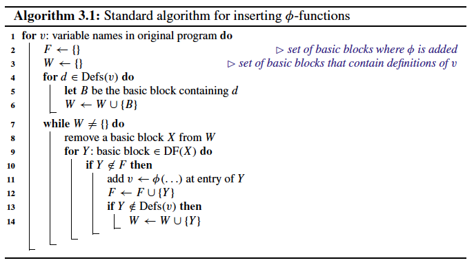
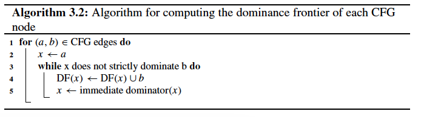

# Chapter 3. Standard Construction and Destruction Algorithms

## 3.1 Construction
The original construction algorithm for SSA form consists of two distinct phases:
* φ-function insertion performs **live range splitting**;
* **variable renaming** assigns a unique variable name to each live range.

### 3.1.1 Join Sets and Dominance Frontiers
For a given set of nodes *S* in a CFG, the join set *J(S)* is the set of join nodes of *S*, i.e., nodes in the CFG that can be reached by two (or more) distinct elements of *S* using disjoint paths.

The **dominance frontier** of a node *n*, *DF(n)*, is the border of the CFG region that is dominated by *n*:
* Node *x* **strictly dominates** node *y* if *x* dominates *y* and *x != y*;
* The set of nodes *DF(n)* contains all nodes *x* such that *n* dominates a direct predecessor of *x* but *n* does not strictly dominate *x*.

$$ DF(S) =  {\bigcup _{s∈S} DF(s)} $$

**Iterated dominance frontier**:

$$ DF^{+}(S) = \lim_{i\to\infty}
\begin{cases}
DF_{1}(S) = DF(S),\\
DF_{i+1}(S) = DF(S \bigcup DF_{i}(S))
\end{cases} $$

*Defs(v)* - set of nodes that contain definitions of *v*.

Construction of minimal SSA requires for each variable *v* the insertion of φ- functions at *J(Defs(v))*.

$$ DF^+(S) = J(S ∪ \{r\}) $$

Original algorithm assumes an implicit definition of every variable at the entry node *r*.

### 3.1.2 φ-Function Insertion
For a given variable *v*, we place φ-functions at the iterated dominance frontier $DF^+(Defs(v))$ where *Defs(v)* is the set of nodes containing definitions of v.

The single definition that reaches each use dominates that use.
