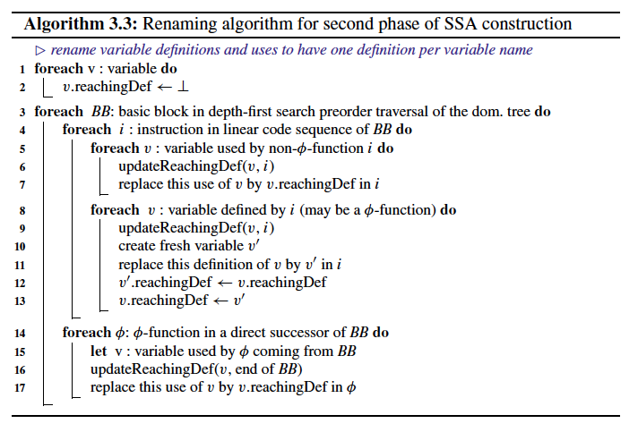
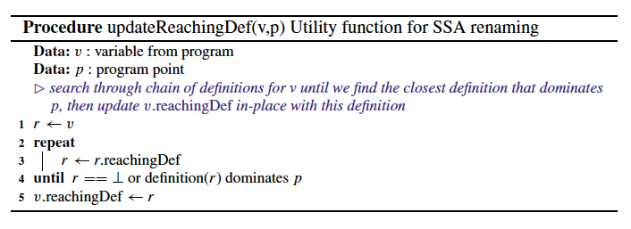
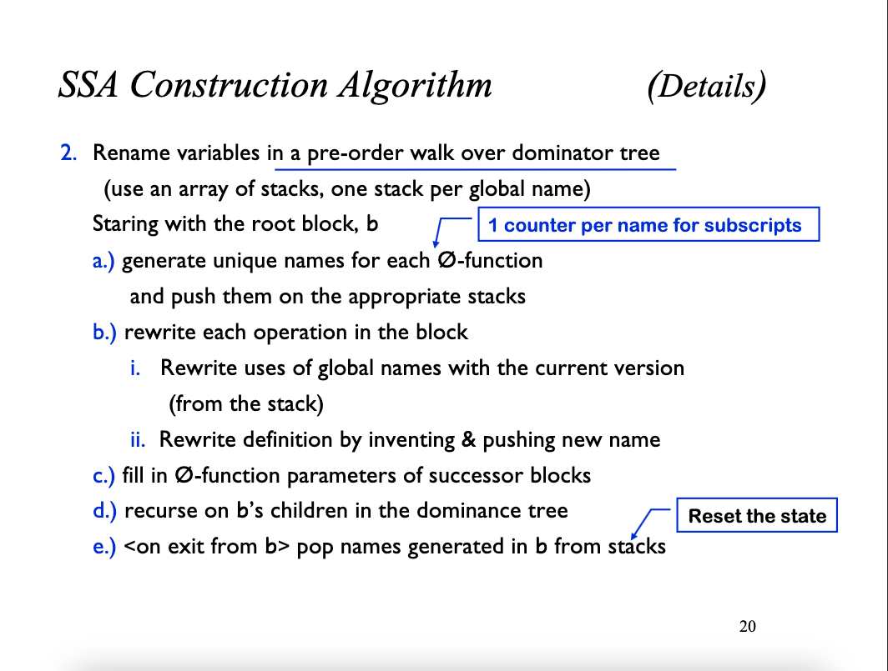
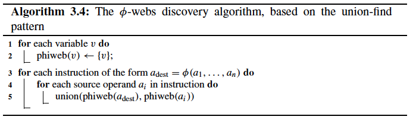
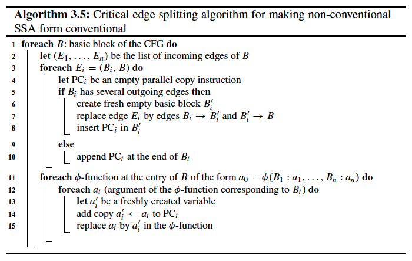
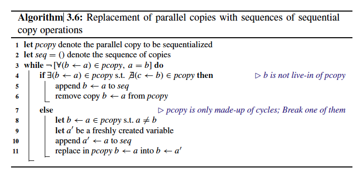
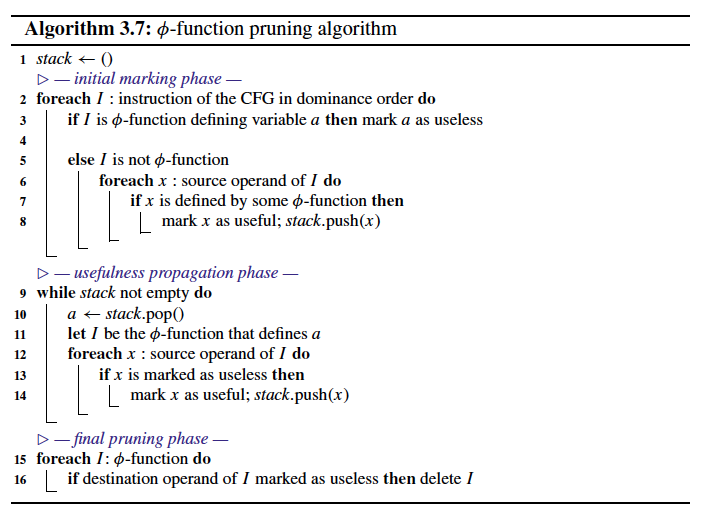

# Chapter 3. Standard Construction and Destruction Algorithms

## 3.1 Construction
The original construction algorithm for SSA form consists of two distinct phases:
* φ-function insertion performs **live range splitting**;
* **variable renaming** assigns a unique variable name to each live range.

### 3.1.1 Join Sets and Dominance Frontiers
For a given set of nodes *S* in a CFG, the join set *J(S)* is the set of join nodes of *S*, i.e., nodes in the CFG that can be reached by two (or more) distinct elements of *S* using disjoint paths.

The **dominance frontier** of a node *n*, *DF(n)*, is the border of the CFG region that is dominated by *n*:
* Node *x* **strictly dominates** node *y* if *x* dominates *y* and *x != y*;
* The set of nodes *DF(n)* contains all nodes *x* such that *n* dominates a direct predecessor of *x* but *n* does not strictly dominate *x*.

$$ DF(S) =  {\bigcup _{s∈S} DF(s)} $$

**Iterated dominance frontier**:

$$ DF^{+}(S) = \lim_{i\to\infty}
\begin{cases}
DF_{1}(S) = DF(S),\\
DF_{i+1}(S) = DF(S \bigcup DF_{i}(S))
\end{cases} $$

*Defs(v)* - set of nodes that contain definitions of *v*.

Construction of minimal SSA requires for each variable *v* the insertion of φ- functions at *J(Defs(v))*.

$$ DF^+(S) = J(S ∪ \{r\}) $$

Original algorithm assumes an implicit definition of every variable at the entry node *r*.

### 3.1.2 φ-Function Insertion
For a given variable *v*, we place φ-functions at the iterated dominance frontier $DF^+(Defs(v))$ where *Defs(v)* is the set of nodes containing definitions of v.

The single definition that reaches each use dominates that use.

A paper ["A Simple, Fast Dominance Algorithm"](../papers/a-simple-fast-dominance-algorithm.pdf) by Keith D. Cooper, Timothy J. Harvey, and Ken Kennedy describes easy to understand and implement algorithms.

### 3.1.3 Variable Renaming

The variable renaming phase associates each individual live range with a new variable name, also called a *version*.

In Algorithm 3.3, we compute and cache the reaching definition for *v* in the per-variable slot “*v*.reachingDef” that is updated as the algorithm traverses the dominator tree of the SSA graph.

Honestly speaking I prefer a standard algorithm for the renaming phase that uses stacks, because it's more straightforward:

### 3.1.4 Summary
The flavour of SSA form that this simple construction algorithm produces:
1. minimal;
2. not pruned;
3. conventional;
4. has the dominance property (strict).

## 3.2 Destruction

When freshly constructed, an untransformed SSA code is conventional and its destruction is straightforward: One simply has to rename all φ-related variable (source and destination operands of the same φ-function) into a unique representative variable.

if all variables of a φ-web have non-overlapping live ranges, then the SSA form is conventional.

The discovery of φ-webs can be performed efficiently using the classical **union-find** algorithm with a disjoint-set data structure.

The simplest (although not the most efficient) way to destroy non-conventional SSA form is to split all critical edges, and then replace φ-functions by copies at the end of direct predecessor basic blocks:
* a **critical edge** is an edge from a node with several direct successors to a node with several direct predecessors.

Once φ-functions have been replaced by parallel copies, we need to sequentialize the parallel copies, i.e., replace them by a sequence of simple copies.

## 3.3 SSA Property Transformations

Making SSA **strict**, i.e., fulfil the **dominance property**, is as “hard” as constructing SSA.

**Pruning SSA form** is equivalent to a dead code elimination pass after SSA construction:
* dead- φ-function elimination simply relies on marking actual use (non-φ-function ones) as useful and propagating usefulness backwards through φ-functions.

