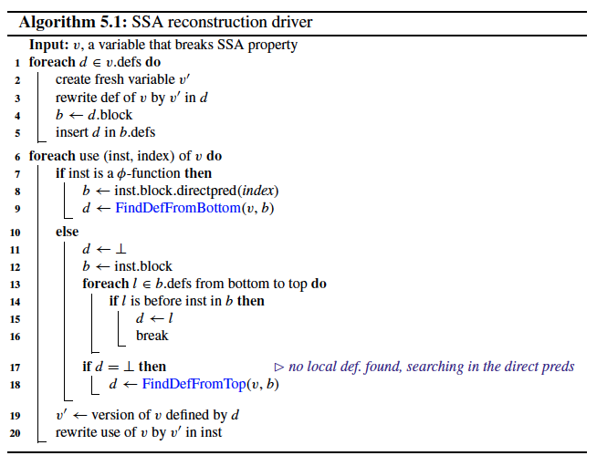
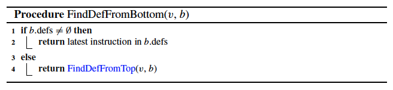
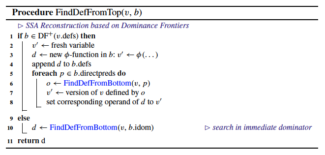
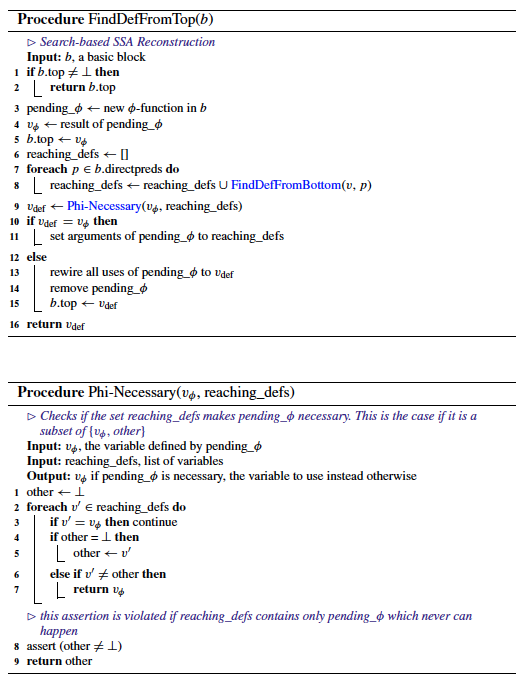

# Chapter 5. SSA Reconstruction

Examples of SSA form violation:
* variable spill;
* path duplication.

## 5.1 General Considerations

*v* - a non-SSA variable.

*v.defs* - the set of all instructions that define *v*.

*b.defs* - all instructions in the block *b* which define one of the variables in *v.defs*.
* It is best to sort this according to the schedule of the instructions in the block from back to front, making the latest definition the first in the list.

## 5.2 Reconstruction Based on the Dominance Frontier

## 5.3 Search-Based Reconstruction

**pending_φ** - a φ-function without arguments;

* Both appraoches construct pruned SSA.
* The first approach produces minimal SSA;
* The second only guarantees minimal SSA for reducible CFGs.