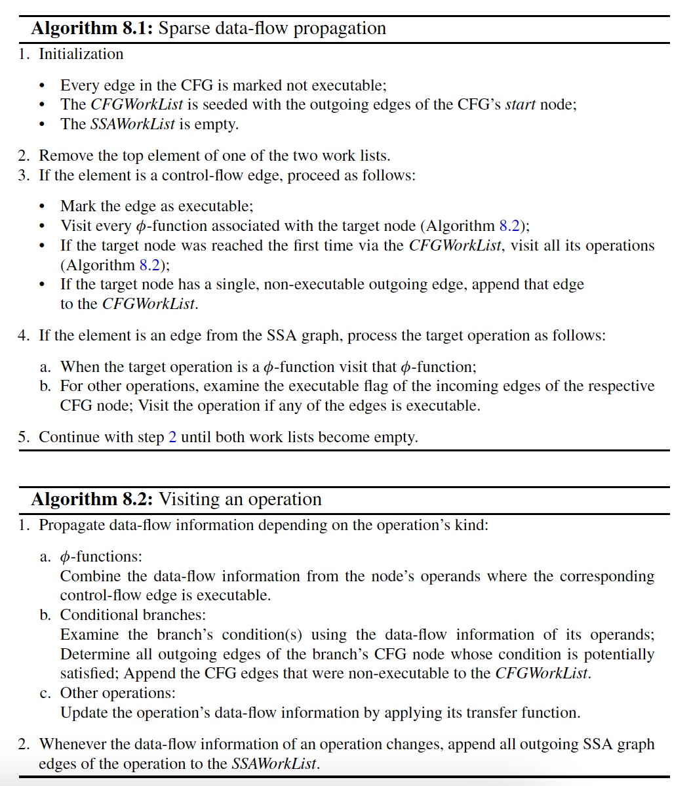

# Chapter 8. Propagating Information Using SSA

## 8.1 Preliminaries

A data-flow problem can be specified using a **monotone framework** that consists of:
* A **complete lattice** representing the property space;
* A **flow graph** resembling the control flow of the input program;
* A set of **transfer functions** modelling the effect of individual operations on the property space.

**Partially ordered sets** (L, ⊆):
* L - program property;
* ⊆ - reflexive, transitive, and antisymmetric relation:
  * Can define for subsets of L:
    * upper bound;
    * lower bound;
    * least upper bound;
    * gretest lower bound.

**Сomplete lattices** - class of partially ordered sets that for all subsets have a least upper bound (**∪, join operator**) as well as a greatest lower bound (**∩, meet operator**):
* ⊥ - the least element;
* ⊤ - the greatest element;
* **Ascending chain** is a totally ordered subset ${\{l_1, . . . , l_n\}}$ of a complete lattice.
* A chain is said to **stabilize** if there exists an index m, where ${∀i > m : l_i = l_m}$.

A **transfer function** transforms the information available from the **in set** of the flow graph node of the operation and stores the result in the corresponding **out set**.

### 8.1.1 Solving Data-Flow Problems
A very popular and intuitive way to solve **data-flow equations** is to compute the **maximal (minimal) fixed point (MFP)** using an iterative work list algorithm:
* Work list contains edges of the flow graph that have to be revisited;
* Visiting an edge:
  * combining the information from the **out set** of the source node with the **in set** of the target node, using the meet or join operator;
  * applying the transfer function of the target node.
* Propagate to all direct successors of the target node by appending the corresponding edges to the work list;
* Terminate when the data-flow information stabilizes.
  
**Height of a lattice** - length of its longest chain.

MFP solution can be computed in O(|V|2 · h) time, h - height of a lattice:
* h depends on properties of the input program.

## 8.2 Data-Flow Propagation Under SSA Form

### 8.2.1 Program Representation

**SSA graph** captures data dependencies and the relevant join nodes in the CFG, it lacks information on other **control dependencies**.

Important to use both the control-flow graph and the SSA graph during data-flow analysis in order to obtain the best possible results.

### 8.2.2 Sparse Data-Flow Propagation

* At φ-functions, the information from multiple control-flow paths is combined using the usual meet or join operator;
* All regular operations are processed by applying the relevant transfer function and possibly propagating the updated information to all uses by appending the respective SSA graph edges to the SSAWorkList.

### 8.2.3 Discussion

Upper bound in execution time: ${O(|E_{SSA}| · h + |E_{CFG}|)}$.