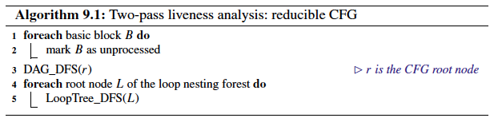
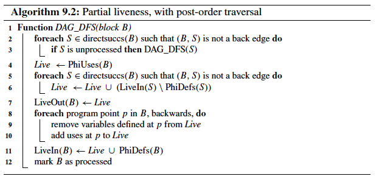
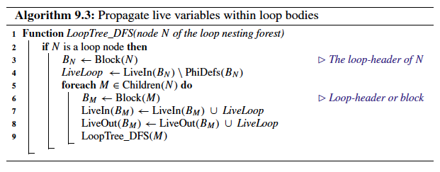

# Chapter 9. Liveness

A **loop nesting forest** is a data structure that represents the loops in a CFG and the containment relation between them.

A **reducible CFG** is one with edges that can be partitioned into two disjoint sets: forward edges, and back edges, such that:
* Forward edges form a **directed acyclic graph** with all nodes reachable from the entry node;
* For all back edges *(A, B)*, node *B* dominates node *A*.

if CFG is **reducible**:
* *v* is live at a program point *q* if and only if *v* is live at the entry *h* of the largest loop/basic block (highest node in the loop nesting forest) that contains *q* but not the definition of *v*;
* *v* is live at *h* if and only if there is a path in the forward-CFG from *h* to a use of *v* that does not contain the definition.

**Consequence**: algorithm that computes liveness sets within two passes:
1. Compute partial liveness sets by traversing the forward-CFG (DAG) backwards;
2. Refine the partial liveness sets and computes the final solution by propagating forwards along the loop nesting forest.

The set of program points where a variable is live (live range) can be computed using a backward traversal starting on its uses and stopping when its definition is reached (unique under SSA).

**Liveness check**:

Algorithm (not based on setting up and solving data-flow equations):
1. a pre-computation part:
   1. independent of variables;
   2. depends on the structure of the control-flow graph;
   3. pre-computed information remains valid when variables or their uses are added or removed.
2. an online part executed at each liveness query:
   1. uses the def-use chain of the variable in question;
   2. determines the answer essentially by testing membership in pre-computed sets of basic blocks.

## 9.1 Definitions

Liveness is a property that relates program points to sets of variables which are considered to be **live** at these program points.

For a CFG node *q*, representing an instruction or a basic block, a variable *v* is **live-in** at *q* if there is a path, not containing the definition of *v*, from *q* to a node where *v* is used (including q itself). It is **live-out** at *q* if it is live-in at some direct successor of *q*.

**Liveness analysis** - the computation of live-in and live-out sets at the entry and the exit of basic blocks.

**Live-range** of a variable specifies the set of program points where that variable is live.

**Definition 9.1** (*Liveness for φ-Function Operands—Multiplexing Mode*)

For a *φ-function* ${a_0 = φ(a_1, . . . , a_n)}$ in block ${B_0}$, where ${a_i}$ comes from block ${B_i}$:
* Its definition-operand is considered to be at the entry of ${B_0}$, in other words variable ${a_0}$ is live-in of ${B_0}$;
* Its use operands are at the exit of the corresponding direct predecessor basic blocks, in other words, variable ${a_i}$ is live-out of basic block ${B_i}$.

## 9.2 Data-Flow Approaches

A use is **upward-exposed** in a block when there is no local definition preceding it, i.e., the live range “escapes” the block at the top:
* sets of upward-exposed uses and definitions do not change during liveness analysis and can be pre-computed:
  * *Defs(B)*: variables defined (φ excluded) in B;
  * *Uses(B)*: variables used in B (φ excluded);
  * *UpwardExposed(B)*: variables used in B without any preceding definition in B;
  * *PhiDefs(B)*: variables defined by a φ at the entry of B;
  * *PhiUses(B)*: variables used in a φ at the entry of a direct successor of B;
    * *LiveIn(B) = PhiDefs(B) ∪ UpwardExposed(B) ∪ (LiveOut(B) \ Defs(B))*;
    * *LiveOut(B) = ${∪_{S∈directsuccs(B)}}$(LiveIn(S) \ PhiDefs(S)) ∪ PhiUses(B)*.

### 9.2.1 Liveness Sets on Reducible Graphs

The key properties of live ranges under strict SSA form on a reducible CFG that we exploit for this purpose can be outlined as follow:
* Let *q* be a CFG node that does not contain the definition *d* of a variable, and *h* be the header of the maximal loop containing q but not d. If such a maximal loop does not exist, then let h = q;
* The variable is live-in at *q* if and only if there exists a forward path from *h* to a use of the variable without going through the definition *d*;
* If a variable is live-in at the header of a loop then it is live at all nodes inside the loop.

Two steps that make up our liveness set algorithm:
1. A backward pass propagates partial liveness information upwards using a postorder traversal of the forward-CFG;
2. The partial liveness sets are then refined by traversing the loop nesting forest, propagating liveness from loop-headers down to all basic blocks within loops.

#### 9.2.1.1 Correctness

The first pass correctly propagates liveness information to the loop-headers of the original CFG:
* **Lemma 9.1.** Let *G* be a reducible CFG, *v* an SSA variable, and *d* its definition. If *L* is a maximal loop not containing *d*, then *v* is live-in at the loop-header *h* of *L* iff there is a path in ${G_{fwd}}$ (i.e., back edge free) from *h* to a use of *v* that does not go through *d*;
* **Lemma 9.2** Let *G* be a reducible CFG, *v* an SSA variable, and *d* its definition. Let *p* be a node of *G* such that all loops containing *p* also contain *d*. Then *v* is live-in at *p* iff there is a path in  ${G_{fwd}}$, from *p* to a use of *v* that does not go through d.

The second pass of the algorithm correctly adds variables to the live-in and live-out sets where they are missing:
* **Lemma 9.3** Let *G* be a reducible CFG, *L* a loop, and *v* an SSA variable. If *v* is live-in at the loop-header of *L*, it is live-in and live-out at every CFG node in *L*.