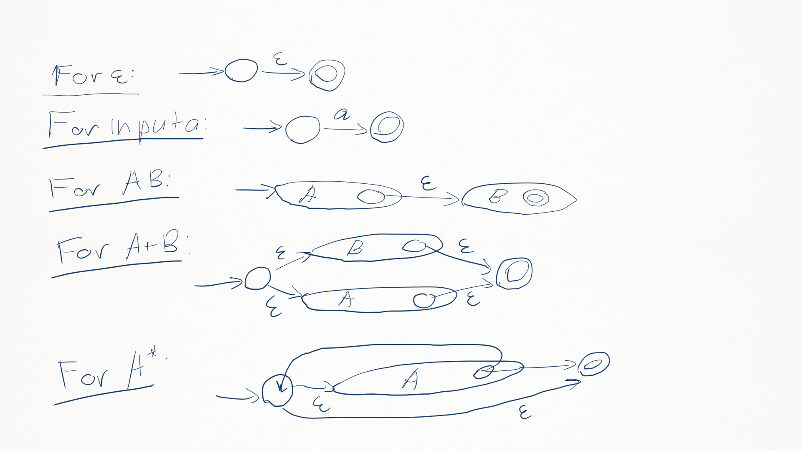

# 03-01: Lexical Analysis Part 1
## Token Class (or Class)
- In English: noun, verb, adjective, ...
- In a programming language: identifier, keywords, <, >, numbers, ...
- Token classes corresponds to sets of strings. 
## The goals of lexical analysis
- Classify program substrings according to role (token class);
- Communicate tokens to the parser; 

Token is a pair `<token class, substrings>`.
# 03-01: Lexical Analysis Part 2
An implementation must do two things:
- Recognize substring corresponding to tokens (<b>lexemes</b>)
- Identify the token class of each lexeme
# 03-03: Regular Languages Part 1
Regular Expressions:
- Single character;
- Epsilon;
- Union (A+B);
- Concatenation (AB);
- Iteration (A*). 

The <b>regular expression</b> over Σ are the smallest set of expressions including:
- ε
- 'c', c ∈ Σ
- R + R
- RR
- R* 

Σ = {0, 1}, (0 + 1)* = Σ*
# 03-03: Regular Languages Part 2
Regular expressions specify regular languages (set of strings); 
Five constructs:
- Two base cases (empty and 1-character strings);
- Three compound expressions (union, concatenation, iteration).
# 03-04: Formal Languages
Let Σ be a set of characters (an <b>alphabet</b>). A <b>language</b> over Σ is a set of strings of characters drawn from Σ. 
<b>Meaning function</b> L maps syntax to semantics. For regular expressions: `L: exp -> set of strings` 
Meaning function:
- makes clear what is syntax, what is semantics;
- allows us to consider notation as a separat issue;
- because expressions and meanings are not 1-1.
# 04-01: Lexical Specification
## Algorithm:
1. Write a rexp for the lexemes of each token class;
2. Construct R, matching all lexemes for all tokens;
3. Let input be x1...xn. For 1 <= i <= n check x1...xi ∈ L(R);
4. if success, then we know that x1...xi ∈ L(Rj) for some j;
5. Remove x1...xi from input and go to 3.
## Extensions:
1. Maximal munch;
2. Choose the one listed first;
3. Create rule for error strings.
# 04-02: Finite Automata Part 1
A finite automation consists of:
- An input alphabet <b>Σ</b>;
- A finite set of states <b>S</b>;
- A start state <b>n</b>;
- A set of accepting states <b>F ⊆ S</b>;
- A set of transitions <b>state ->(input) state</b>.
# 04-02: Finite Automata Part 2
## DFA:
- One transition per input per state;
- No ε-moves. 

## NFA:
- Can have multiple transitions for one input in a given state;
- Can have ε-moves. 

## Difference:
- A DFA takes only one path through the state graph;
- An NFA can choose;
- An NFA accepts if some choices lead to an accepting state;
- DFAs are faster to execute;
- NFAs are, in general, smaller (exponentially).
# 04-03: Regular Expressions into NFAs
Lexical Specification -> Regular Expression -> NFA -> DFA -> Table-driven inplementation of DFA 
For each kind of rexp, define an equivalent NFA: 

# 04-04: NFA to DFA
<b>ε-closure</b> of a state is all states that are reachable by ε-edge from a state. 
DFA: 
<b>states</b>: subsets of S except the empty state, S - set of states of NFA; 
<b>start</b>: ε-clousure(s), s - the start state of NFA; 
<b>final</b>: { X | X ∩ F != 0, F - final states of NFA }; 
<b>trans</b>: X ->(a) Y if Y = ε-clousure({ y | x ∈ X and x ->(a) y }).
# 04-05: Implementing Finite Automata
A DFA can be implemented by a 2D table T:
- One dimension is states;
- Other dimension is input symbol;
- For every transition si ->(a) sk define T[i,a]=k.